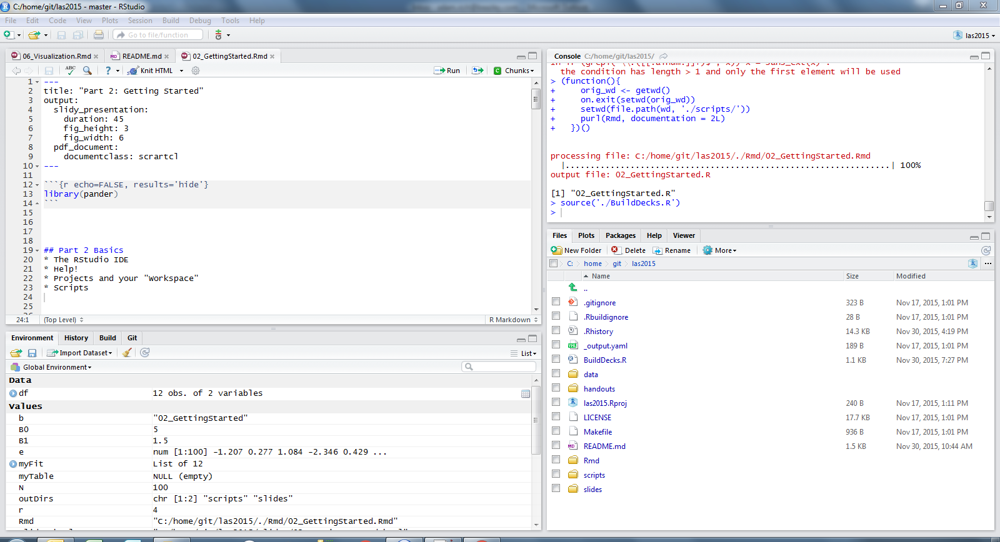

```{r echo=FALSE, results='hide'}
library(pander)
```


## "Getting Started" Outline
* The RStudio IDE
* Basic Syntax
* Help!
* Projects and your "Workspace"
* Scripts


## The RStudio IDE



## Basic Syntax
* Mathematical Operators
* Logical Operators
* Assignment
* Parentheses
* Calling Functions


## Examples
```{r results='hide'}
2 + 5
-2^0.5
-(2^0.5)
abs(-15.4)
a <- 0
a == 0
a = 0
```


## Using Functions
Functions in R are very similar to functions in a spreadsheet.
The function takes in arguments and returns a result.

```{r }
sqrt(4)
```

Functions may be composed by having the output of one serve as the input to another.

$\sqrt{e^{sin{\pi}}}$

```{r }
sqrt(exp(sin(pi)))
```


## A few mathematical functions

```{r eval=FALSE, echo=FALSE}
?S3groupGeneric
```

* abs, sign
* floor, ceiling, trunc, round, signif
* sqrt, exp, log
* cos, sin, tan (and many others)
* lgamma, gamma, digamma, trigamma

## Getting help

```{r eval=FALSE, echo=TRUE, size='tiny'}
?plot

??cluster
```

Within RStudio, the TAB key will autocomplete

## The working directory

The source of much frustration when starting out.

Where am I?

```{r eval=TRUE, echo=TRUE, size='tiny'}
getwd()
```

How do I get somewhere else?

```{r eval=FALSE, results='hide', size='tiny'}
setwd("~/SomeNewDirectory/SomeSubfolder")
```

Try to stick with relative pathnames. This makes work portable.

## Directory paths

R prefers *nix style directories, i.e. "/", NOT "\\". Windows prefers "\\".

"\\" is an "escape" character, used for things like tabs and newline characters. To get a single slash, just type it twice.

More on file operations in the handout.

## Source files

Typing, editing and debugging at the command line will get tedious quickly.

A source file (file extension .R) contains a sequence of commands.

Analogous to the formulae entered in a spreadsheet (but so much more powerful!)

## Your first script

```{r}
N <- 100
B0 <- 5
B1 <- 1.5

set.seed(1234)

e <- rnorm(N, mean = 0, sd = 1)
X1 <- rep(seq(1,10),10)

Y <- B0 + B1 * X1 + e

myFit <- lm(Y ~ X1)
```

Save this file.

CTRL-S on Windows/Linux, CMD-S on Mac.

## Executing a script

Either: 

1. Open the file and execute the lines one at a time, or

2. Use the "source" function.

```{r eval=FALSE}
source("SomefileName.R")
```

Within RStudio, you may also click the "Source" button in the upper right hand corner.

## Comments

R uses the hash/pound character "#" to indicate comments.

SQL or C++ style multiline comments are not supported.

Comment early and often!

Comments should describe "why", not "what".

#### Bad comment
```{r eval=FALSE}
# Take the ratio of loss to premium to determine the loss ratio

lossRatio <- Losses / Premium
```

#### Good comment
```{r eval=FALSE}
# Because this is a retrospective view of 
# profitability, these losses have been
# developed, but not trended to a future
# point in time
lossRatio <- Losses / Premium
```

## Quiz

* What is the area of a cylinder with radius = e and height = pi?
* What arguments are listed for the "plot" function?
* Find the help file for a generalized linear model
* Create a script which calculates the area of a cylinder. From a new script, assign the value 4 to a variable and source the other file. Assign the value 8 to your variable and source again. What happened?
