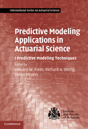
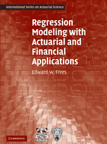

##  {.flexbox .vcenter}

> "Relax and embrace the chaos that is R."

Patrick Burns
  
[www.burns-stat.com/pages/Present/infernoishR_annotated.pdf](www.burns-stat.com/pages/Present/infernoishR_annotated.pdf)

##

Does everyone have R and RStudio installed?

## What the heck is R? {.smaller .build}

While some folks are getting software sorted out, we'll have a brief review of the history of R. 
Let's get this done quick. If you don't have R and R Studio installed, today will be a long day.

R is a programming framework designed by and for statisticians. R is ... 

* Free: It costs nothing to use.
* Open source: The source code is available to the public to view and modify (within restrictions).
* Extendable: Anyone may write extensions to the software. At present there are 4,000 user contributed packages and counting.
* Advanced statistical techniques are available out of the box. 
* Machine learning algorithms- cluster analysis, neural networks, etc. Any time someone invents a new way to analyze data, it is quickly available in R.
* Visualize network graphs, construct word clouds, render maps. Visualization is tremendous. Bar charts and scatter plots are the tip of the iceberg. R can do it all and keeps getting better.
* Really, really cool 

----

> "[...] R is not software, it is a community."
  
  - Patrick Burns
  

## First, there was S

```{r eval=FALSE, echo=FALSE}

```


In the alphabet, R comes before S. In software, S comes before R. S was developed at Bell Labs by Paul Chambers and some others back in the late '70s. Sweeping changes by 1988. Further changes in 1992.

## And then there was R


R was created by Ross Ihaka and Robert Gentleman as an open source alternative to S. First release in 1993.


## Nearly 40 years of development


## R package growth


## Actuarial R packages

Several packages developed for actuarial use:

* actuar
* ChainLadder
* lossDev
* favir
* MRMR

Many articles in Variance and other publications include R code.

## Books about R for actuaries!






## What's RStudio?

RStudio is an Integrated Development Environment (IDE). It's not necessary, but provides quite a few nice features:

* Edit multiple scripts at a time, syntax coloring
* Manage projects, version control
* View variables in memory, debug code
* Support for package development
* Reproducible research

----

Does R and RStudio work for everyone?
